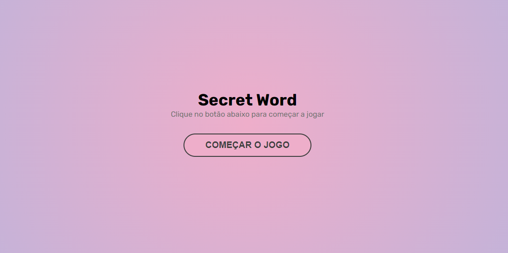

<h1 align="center">Secret Word</h1>

<p align="center">
  <a href="#-tecnologias">Tecnologias</a>&nbsp;&nbsp;&nbsp;|&nbsp;&nbsp;&nbsp;
  <a href="#-iniciando-a-aplicação">Iniciando</a>&nbsp;&nbsp;&nbsp;|&nbsp;&nbsp;&nbsp;
  <a href="#-projeto">Projeto</a>&nbsp;&nbsp;&nbsp;|&nbsp;&nbsp;&nbsp;
  <a href="#memo-licença">Licença</a>&nbsp;&nbsp;&nbsp;|&nbsp;&nbsp;&nbsp;
  <a href="#-contato">Contato</a>
</p>

<p align="center">
  
</p>

<br>

<p align="center">
  
</p>
<p align="center">
  
</p>

## 🚀 Tecnologias

Esse projeto foi desenvolvido com as seguintes tecnologias:

- Front-end
  - **React(useState, useEffect, useCallback)**
  - **Sass**

## :car: Iniciando a aplicação

Baixe o repositório com git clone e entre na pasta para instalar as dependencias do projeto. Deixe o servidor executando e inicia as instanciâs desktop ou mobile.<br/>

```bash
$ git clone https://github.com/MarlonChi/secret-word
```

```bash
$ npm install
$ npm run dev
```

## 💻 Projeto

Secret Word consiste em um jogo onde o usuário deve adivinhar uma palavra letra por letra. Quanto mais palavras adivinhar maior a pontuação.
<br/>

## :memo: Licença

Esse projeto está sob a [licença MIT](LICENSE).

## :email: Contato

## E-mail: [**marlonchiodelli@hotmail.com**](mailto:marlonchiodelli@hotmail.com)
